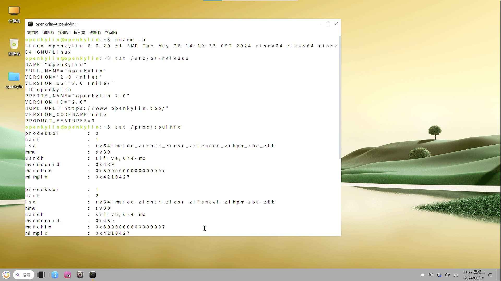

# openKylin 2.0 SP1 Milk-V Mars Test Report

## Test Environment

### Operating System Information

- System Version: openKylin 2.0 SP1
- Download Link: <https://www.openkylin.top/downloads/>
- Reference Installation Document:
  - <https://milkv.io/zh/docs/mars/getting-started/boot>
  - <https://docs.openkylin.top/zh/01_%E5%AE%89%E8%A3%85%E5%8D%87%E7%BA%A7%E6%8C%87%E5%8D%97/%E5%9C%A8riscv%E4%B8%8A%E5%AE%89%E8%A3%85/%E5%9C%A8VisionFive2%E4%B8%8A%E5%AE%89%E8%A3%85openKylin>

### Hardware Information

- Milk-V Mars (8GB RAM)
- A USB power adapter and A USB-A to C or C to C cable
- A microSD card
- A USB to UART debugger (e.g., CH340, CH341, FT2232, etc.)
- A HDMI cable, A USB Mouse and A USB Keyboard

## Installation Steps

### Decompress and Flash Image to microSD Card

Use `xz` to decompress the image,  and then use `dd` command or `balenaEtcher` software to flash the image to the microSD card. (Assuming `/dev/sdc` is the microSD card device)

```bash
xz -d openKylin-Embedded-V2.0-SP1-visionfive2-riscv64.img.xz

sudo dd if=openKylin-Embedded-V2.0-SP1-visionfive2-riscv64.img of=/dev/sdc bs=1M status=progress

sync
```

### Boot Mode Selection

Milk-V Mars provides multiple boot modes after the hardware version V1.2, which can be configured via onboard dip switches before powering on; the board itself is also silk-screened for reference.

To boot the Armbian image, select the SPI Flash boot mode (`GPIO_0 = 0`, `GPIO_1 = 0`). Note that this mode may require you to update the firmware in the Flash beforehand.

### Logging into the System

Log into the system via the serial port.

Default username: `openkylin`

Default password: `openkylin`

## Expected Results

The system should boot up normally and allow login via the serial port.After connect HDMI to the display screen can normally display the login image, and supports USB mouse and USB keyboard.

## Actual Results

The system starts normally and the output is successfully viewed through the serial port.After connect HDMI to the display screen can normally display the login image, and supports USB mouse and USB keyboard.

### Boot Log

```log
openKylin 2.0 openkylin ttyS0

openkylin login: [  OK  ] Started user@105.service - User Manager for UID 105.
[  OK  ] Started session-c1.scope - Session c1 of User lightdm.
         Starting rtkit-daemon.service - Re…imeKit Scheduling Policy Service...
[  OK  ] Started rtkit-daemon.service - RealtimeKit Scheduling Policy Service.
         Starting upower.service - Daemon for power management...
[  OK  ] Started upower.service - Daemon for power management.
         Starting NetworkManager-dispatcher…anager Script Dispatcher Service...
[  OK  ] Started NetworkManager-dispatcher.… Manager Script Dispatcher Service.
[  OK  ] Started nmbd.service - Samba NMB Daemon.
         Starting smbd.service - Samba SMB Daemon...
[  OK  ] Started smbd.service - Samba SMB Daemon.
[  OK  ] Reached target multi-user.target - Multi-User System.
[  OK  ] Reached target graphical.target - Graphical Interface.
         Starting systemd-update-utmp-runle…- Record Runlevel Change in UTMP...
[  OK  ] Finished systemd-update-utmp-runle…e - Record Runlevel Change in UTMP.

openkylin login: openkylin
密码：
Welcome to openKylin 2.0 (GNU/Linux 6.6.20 riscv64)

 * Support:        https://openkylin.top

The programs included with the openKylin system are free software;
the exact distribution terms for each program are described in the
individual files in /usr/share/doc/*/copyright.

openKylin comes with ABSOLUTELY NO WARRANTY, to the extent permitted by
applicable law.

You do not have any new mail.
load environment: QT_ACCESSIBILITY=1
load environment: PATH=/usr/local/sbin:/usr/local/bin:/usr/sbin:/usr/bin:/sbin:/bin:/usr/games:/usr/local/games:/snap/bin
openkylin@openkylin:~$ 

openkylin@openkylin:~$ uname -a
Linux openkylin 6.6.20 #1 SMP Tue May 28 14:19:33 CST 2024 riscv64 riscv64 riscv64 GNU/Linux

openkylin@openkylin:~$ cat /etc/os-release
NAME="openKylin"
FULL_NAME="openKylin"
VERSION="2.0 (nile)"
VERSION_US="2.0 (nile)"
ID=openkylin
PRETTY_NAME="openKylin 2.0"
VERSION_ID="2.0"
HOME_URL="https://www.openkylin.top/"
VERSION_CODENAME=nile
PRODUCT_FEATURES=3

openkylin@openkylin:~$ cat /proc/cpuinfo
processor       : 0
hart            : 1
isa             : rv64imafdc_zicntr_zicsr_zifencei_zihpm_zba_zbb
mmu             : sv39
uarch           : sifive,u74-mc
mvendorid       : 0x489
marchid         : 0x8000000000000007
mimpid          : 0x4210427

processor       : 1
hart            : 2
isa             : rv64imafdc_zicntr_zicsr_zifencei_zihpm_zba_zbb
mmu             : sv39
uarch           : sifive,u74-mc
mvendorid       : 0x489
marchid         : 0x8000000000000007
mimpid          : 0x4210427

processor       : 2
hart            : 3
isa             : rv64imafdc_zicntr_zicsr_zifencei_zihpm_zba_zbb
mmu             : sv39
uarch           : sifive,u74-mc
mvendorid       : 0x489
marchid         : 0x8000000000000007
mimpid          : 0x4210427

processor       : 3
hart            : 4
isa             : rv64imafdc_zicntr_zicsr_zifencei_zihpm_zba_zbb
mmu             : sv39
uarch           : sifive,u74-mc
mvendorid       : 0x489
marchid         : 0x8000000000000007
mimpid          : 0x4210427

openkylin@openkylin:~$
```

GUI for desktop：



## Test Criteria

Successful: The actual result matches the expected result.

Failed: The actual result does not match the expected result.

## Test Conclusion

Test successful.
