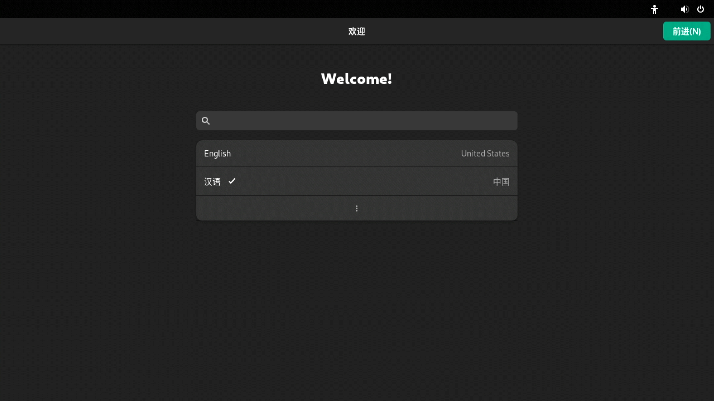

# SpacemiT MusePi Pro, Bianbu UEFI v1.2 Test Report

## Test Environment

### System Information

- Download Link: https://archive.spacemit.com/image/k1/version/bianbu-computer-uefi/v1.2/
- Reference Install Document: https://developer.spacemit.com/documentation?token=QSfGwmkhqiHwqQkHmCicH2Qnnyg


### Hardware Information

- SpacemiT MusePi Pro Board
- USB Charger
- USB Type-C cables
- UART to USB Debugger
- microSD Card (If flash to SD card)

## Installation Steps

### Flashing the Image (SD Card)

**Please make sure to choose the file ending with `.img.zip`**

**Note: Please pay attention to use the uefi image, instead uboot image used by other k1/m1 devices.**

After downloading and extracting the image, use `dd` to flash the image to the microSD card.

```bash
unzip bianbu-computer-s1-uefi-release-for-pipro-v1.2-release-20250421182705.img.zip
sudo dd if=bianbu-computer-s1-uefi-release-for-pipro-v1.2-release-20250421182705.img of=/dev/your-device bs=1M status=progress
```

Please replace `/dev/your-device` with the actual device name of your microSD card. Make sure to double-check the device name to avoid overwriting your own disk.

### Flashing the Image (eMMC)

**Please make sure to choose the file ending without `.img`**

**Note: Please pay attention to use the uefi image, instead uboot image used by other k1/m1 devices.**

After downloading and extracting the image, use `fastboot` to flash the image to the eMMC.

```bash
unzip bianbu-computer-s1-uefi-release-for-pipro-v1.2-release-20250421182705.zip
```

Under the USB Type-A port, you can see three buttons. Let the ethernet port facing up, from top to bottom, the buttons are **PWR**, **RST**, and **FDL** . You shall hold the **FDL** button while power on/RST, to enter the fastboot mode. You shall see the dfu-device in your system:

```log
❯ sudo fastboot devices
dfu-device       DFU download
```

```bash
sudo fastboot stage factory/FSBL.bin
sudo fastboot continue
sleep 1 # Wait for 1 sec
sudo fastboot stage u-boot.itb
sudo fastboot continue
sleep 1 # Wait for 1 sec
sudo fastboot flash gpt partition_universal.json
sudo fastboot flash bootinfo factory/bootinfo_sd.bin
sudo fastboot flash fsbl factory/FSBL.bin
sudo fastboot flash env env.bin
sudo fastboot flash opensbi fw_dynamic.itb
sudo fastboot flash uboot u-boot.itb
sudo fastboot flash ESP efi.img
sudo fastboot flash bootfs_linux bootfs_linux.img
sudo fastboot flash rootfs_linux rootfs_linux.ext4
sudo fastboot flash bootfs bootfs.ext4
sudo fastboot flash rootfs rootfs.ext4
```


### Logging into the System

Logging into the system via the serial port.

> Note: If you boot into the desktop, you can see a install wizard. Follow the wizard to setup the account and password.

Default Username: `root`
Default Password: `bianbu`

## Expected Results

The system should boot normally and allow login via the onboard serial port. Can also login via the desktop.

## Actual Results

The system booted successfully and login via the onboard serial port was also successful. Can also login via the desktop.

### Boot Log

Screen recording (from flashing image to login):
[](https://asciinema.org/a/6ZcuURjMvgO4BJVTTaQWGwcve)

```log
Bianbu 2.1 k1 ttyS0
                                             
k1 login: root
密码： 
Welcome to Bianbu 2.1 (GNU/Linux 6.6.63 riscv64)

 * Documentation:  https://bianbu.spacemit.com
 * Support:        https://ticket.spacemit.com

The programs included with the Bianbu system are free software;
the exact distribution terms for each program are described in the
individual files in /usr/share/doc/*/copyright.

Bianbu comes with ABSOLUTELY NO WARRANTY, to the extent permitted by
applicable law.

root@k1:~# uname -a
Linux k1 6.6.63 #2.2~rc3.2 SMP PREEMPT Thu Apr  3 06:53:27 UTC 2025 riscv64 riscv64 riscv64 GNU/Linux
root@k1:~# cat /etc/os-release 
PRETTY_NAME="Bianbu Star 2.1"
NAME="Bianbu"
VERSION_ID="2.1"
VERSION="2.1 (Noble Numbat)"
VERSION_CODENAME=noble
ID=bianbu
ID_LIKE=debian
HOME_URL="https://bianbu.spacemit.com"
SUPPORT_URL="https://bianbu.spacemit.com"
BUG_REPORT_URL="https://ticket.spacemit.com"
PRIVACY_POLICY_URL="https://www.spacemit.com/privacy-policy"
UBUNTU_CODENAME=noble
LOGO=ubuntu-logo
root@k1:~# lscpu
架构：                riscv64
  字节序：            Little Endian
CPU:                  8
  在线 CPU 列表：     0-7
型号名称：            Spacemit(R) X60
  每个核的线程数：    1
  每个座的核数：      8
  座：                1
  CPU(s) scaling MHz: 100%
  CPU 最大 MHz：      1600.0000
  CPU 最小 MHz：      614.4000
Caches (sum of all):  
  L1d:                256 KiB (8 instances)
  L1i:                256 KiB (8 instances)
  L2:                 1 MiB (2 instances)
root@k1:~# 
```




## Test Criteria

Successful: The actual result matches the expected result.

Failed: The actual result does not match the expected result.

## Test Conclusion

Test successful.