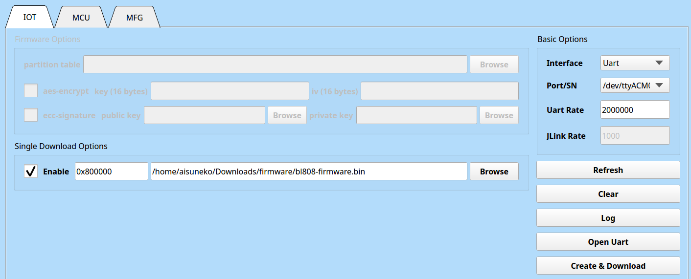

# Arch Linux Pine64 Ox64 Test Report

## Test Environment

### Operating System Information

- BuildRoot
  - Download Link: https://github.com/domhathair/pine64_ox64_archlinux/releases/download/v2024.06.1/sdcard.tar.gz
    - SDK: https://github.com/bouffalolab/bl_mcu_sdk
    - Flashing Tool: https://openbouffalo.org/static-assets/bldevcube/BouffaloLabDevCube-v1.8.3.zip
  - Reference Installation Document: https://github.com/domhathair/pine64_ox64_archlinux

### Hardware Information

- Pine64 Ox64
- A Type-C or microUSB cable
- A UART debugger (CH340G preferred, *avoid* CP2102)
- A microSD card
- A microSD card reader

## Installation Steps

### Get the Image

Download and extract the precompiled image and firmware:
```bash
wget https://github.com/openbouffalo/buildroot_bouffalo/releases/download/v1.0.1/bl808-linux-pine64_ox64_full_defconfig.tar.gz
tar -xvf bl808-linux-pine64_ox64_full_defconfig.tar.gz
cd bl808-linux-pine64_ox64_full_defconfig/firmware
xz -d sdcard-pine64_ox64_full_defconfig.img.xz
```

### Flashing the Firmware via UART

Power on the board through either the microUSB or Type-C port while holding down the BOOT button. Connect GPIO ports 14 and 15 to your debugger's RX and TX, respectively - This is the "Flashing UART".

Download the flashing tool and use the appropriate version for your system to flash the firmware. Make sure your BLDevCube binary is of version 1.8.3 **or lower**.

Enter the MCU tab and set the parameters as shown below:

M0: Group: group0, Image Addr: `0x58000000`, and choose `m0_lowload_bl808_m0.bin` from the above archive

D0: Group: group0, Image Addr: `0x58100000`, and choose `d0_lowload_bl808_d0.bin` from the above archive

Choose your UART port correspondingly and set the "Uart Rate" to 2000000.

Click "Create & Download" and wait for it to complete.


Next, Enter the IOT tab and set the parameters as shown below:

Enable "Single Download", set address to `0x800000` and choose `bl808-firmware.bin` from the above archive.

Click "Create & Download" and wait for it to complete.



### Flash the image to SD card

```shell
wget https://github.com/domhathair/pine64_ox64_archlinux/releases/download/v2024.06.1/sdcard.tar.gz
tar -xvf sdcard.tar.gz
dd if=sdcard.img of=/dev/your/device status=progress
```

### Boot

Insert the SD card, and connect GPIO ports 32 and 31 to your debugger's RX and TX, respectively - This is the "Serial Console UART". Remember to set the baud rate to 2000000.

Default Username: `root`
Default Password: `archriscv`

## Expected Results

The system should start normally with serial output.

## Actual Results

The system started successfully, with serial output.

### Boot Information

```log
Arch Linux 6.5.11 (hvc0)

buildroot login:
Arch Linux 6.5.11 (ttyS0)

buildroot login: root
Password:
[root@buildroot ~]# uname -a
Linux buildroot 6.5.11 #1 Fri Jun 28 00:07:35 MSK 2024 riscv64 GNU/Linux
[root@buildroot ~]# cat /etc/os-release
NAME="Arch Linux"
PRETTY_NAME="Arch Linux"
ID=arch
BUILD_ID=rolling
ANSI_COLOR="38;2;23;147;209"
HOME_URL="https://archlinux.org/"
DOCUMENTATION_URL="https://wiki.archlinux.org/"
SUPPORT_URL="https://bbs.archlinux.org/"
BUG_REPORT_URL="https://gitlab.archlinux.org/groups/archlinux/-/issues"
PRIVACY_POLICY_URL="https://terms.archlinux.org/docs/privacy-policy/"
LOGO=archlinux-logo
[root@buildroot ~]# lscpu
Architecture:           riscv64
  Byte Order:           Little Endian
CPU(s):                 1
  On-line CPU(s) list:  0
Vendor ID:              0x5b7
  Model name:           -
    CPU family:         0x0
    Model:              0x0
    Thread(s) per core: 1
    Core(s) per socket: 1
    Socket(s):          1
[root@buildroot ~]#
```

## Test Criteria

Successful: The actual result matches the expected result.

Failed: The actual result does not match the expected result.

## Test Conclusion

Test successful.

