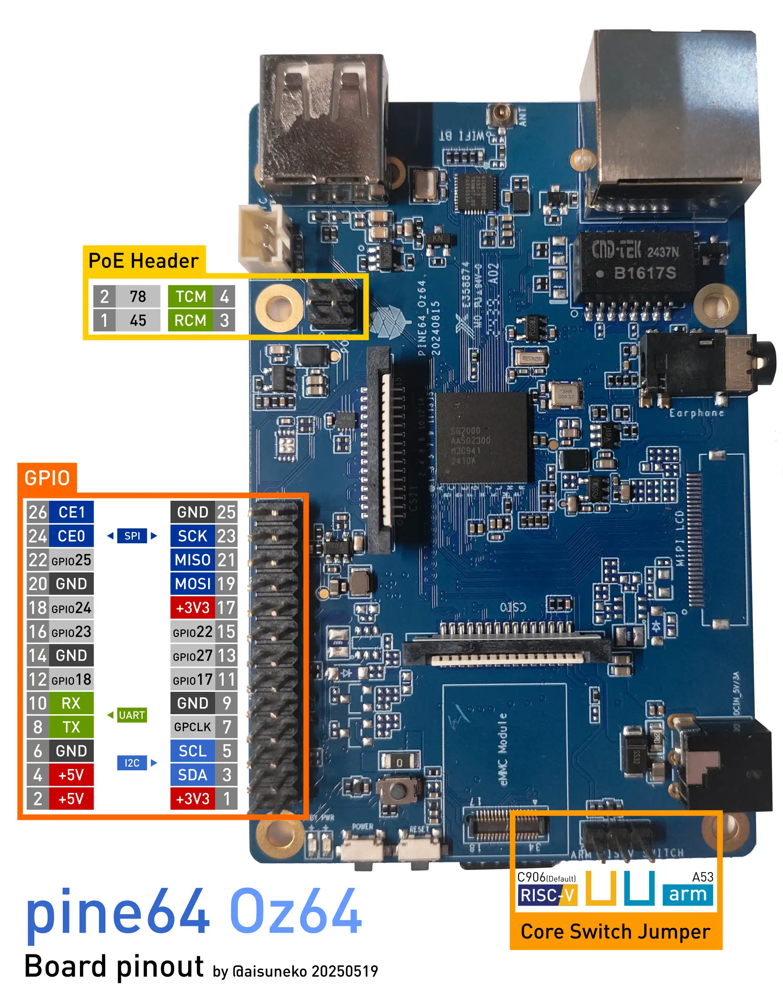

# NuttX Pine64 Oz64 Test Report

## Test Environment

### Operating System Information

- Debian Linux Image + U-Boot: https://github.com/scpcom/sophgo-sg200x-debian/releases
- Precompiled NuttX Image: https://github.com/lupyuen2/wip-nuttx/releases/tag/sg2000c-1
- Toolchain: xPack https://github.com/xpack-dev-tools/riscv-none-elf-gcc-xpack/releases
- dtb file: https://github.com/lupyuen2/wip-nuttx/releases/download/sg2000-1/cv181x_milkv_duos_sd.dtb
- Reference Installation Document: https://nuttx.apache.org/docs/latest/quickstart/install.html


### Hardware Information

- Pine64 Oz64
- 5V3A DC Barrel power adapter
- A microSD card
- A USB card reader
- A USB to UART Debugger
- DuPont wires

Board pinout:



## Installation Steps

### Using Precompiled Kernel Image

Download the Debian Image and the NuttX kernel to do a manual kernel swap following something like the steps below:

```shell
wget https://github.com/scpcom/sophgo-sg200x-debian/releases/download/v1.6.10/duos-e_sd.img.lz4
wget https://github.com/lupyuen2/wip-nuttx/releases/download/sg2000c-1/Image
lz4 -dk duos-e_sd.img.lz4
sudo losetup /dev/loop14 duos-e_sd.img
sudo kpartx -av /dev/loop14
sudo mount /dev/mapper/loop14p1 /mnt
sudo mv Image /mnt/vmlinuz-*+duos
sudo umount /mnt
sudo kpartx -d /dev/loop14
sudo losetup -d /dev/loop14
sudo dd if=duos-e_sd.img of=/dev/sdX bs=1M status=progress
```

### Compiling Manually

#### Install Build Dependencies

Debian based:
```bash
sudo apt install \
bison flex gettext texinfo libncurses5-dev libncursesw5-dev xxd \
gperf automake libtool pkg-config build-essential gperf genromfs \
libgmp-dev libmpc-dev libmpfr-dev libisl-dev binutils-dev libelf-dev \
libexpat-dev gcc-multilib g++-multilib picocom u-boot-tools util-linux

sudo apt install kconfig-frontends
# pip install kconfiglib
```

Fedora / RPM based:
```bash
sudo dnf install \
bison flex gettext texinfo ncurses-devel ncurses ncurses-compat-libs \
gperf automake libtool pkgconfig @development-tools gperf genromfs \
gmp-devel mpfr-devel libmpc-devel isl-devel binutils-devel elfutils-libelf-devel \
expat-devel gcc-c++ g++ picocom uboot-tools util-linux

pip install kconfiglib
# Or install from source:
# git clone https://bitbucket.org/nuttx/tools.git
# cd tools/kconfig-frontends
# ./configure --enable-mconf --disable-nconf --disable-gconf --disable-qconf
# aclocal
# automake
# make
# sudo make install
```

Arch / pacman based:
```shell
sudo pacman -S --needed base-devel ncurses5-compat-libs gperf pkg-config gmp libmpc mpfr libelf expat picocom uboot-tools util-linux git wget libisl
# AUR packages only, use any AUR helper as you wish
paru -S kconfig-frontends genromfs
# yay -S kconfig-frontends genromfs
```

#### Retrieve the Source Code

```shell
mkdir nuttxspace
cd nuttxspace
git clone https://github.com/apache/nuttx.git nuttx
git clone https://github.com/apache/nuttx-apps apps
```

#### Configure Toolchain and Build NuttX

The xPack toolchain is needed for the compilation, get the toolchain first from the Github, suggest 13.3.0 version as it has been tested, change the version to match your system:
```bash
wget https://github.com/xpack-dev-tools/riscv-none-elf-gcc-xpack/releases/download/v11.5.0-1/xpack-riscv-none-elf-gcc-13.3.0-1-linux-x64.tar.gz
tar -xvzf xpack-riscv-none-elf-gcc-13.3.0-1-linux-x64.tar.gz
```

Export it into your PATH:
```bash
export PATH=/path/to/toolchain/you/untar:$PATH
```


Then, build the Nuttx kernel:
```shell
cd nuttx
tools/configure.sh milkv_duos:nsh
make -j$(nproc)
```

If you encounter file loss during the build process, you can configure options through menuconfig
- Select whether to use the math library and its path in (Top) → Library Routines → Select math library
- Select whether to enable llvm in (Top) → Library Routines → Builtin libclang_rt.profile

Then, build the file system:
```bash
make export
pushd ../apps
tools/mkimport.sh -z -x ../nuttx/nuttx-export-*.tar.gz
make import
popd
genromfs -f initrd -d ../apps/bin -V "NuttXBootVol"

```


Finally , padding the image:
```bash
head -c 65536 /dev/zero >/tmp/nuttx.pad
cat nuttx.bin /tmp/nuttx.pad initrd >Image-sg2000
```


## System Boot

### Booting from SD card

See the chapter "Installation Steps/Using Precompiled Kernel Image".

### Booting NuttX RTOS from TFTP Server

First, flash the Debian image onto the storage card.

```shell
wget https://github.com/Fishwaldo/sophgo-sg200x-debian/releases/download/v1.4.0/duos_sd.img.lz4
lz4 -d duos_sd.img.lz4
sudo dd if=duos_sd.img of=/dev/sdX bs=1M status=progress
```

The storage card is now ready. Insert it into the development board.

Start a TFTP server on your computer. Ensure both the compiled Image (located in the NuttX source directory) and dtb are accessible by the TFTP server.

Refer to: [Arch Wiki/TFTP](https://wiki.archlinux.org/title/TFTP) for TFTP server configuration. Generally speaking, you can try tftpd:
```bash
systemctl start tftpd
```

On Windows, you may consider using [Tftpd64](http://tftpd32.jounin.net).

Put the image file and dtb file under the tftp service foder, like for tftpd, it's `/srv/tftp`:
```bash
wget https://github.com/lupyuen2/wip-nuttx/releases/download/sg2000-1/cv181x_milkv_duos_sd.dtb
cp Image-sg2000 /path/to/tftp/folder
cp cv181x_milkv_duos_sd.dtb /path/to/tftp/folder
```

Connect the UART debug cable, power on the development board, and press any key when prompted (`Hit any key to stop autoboot`) to interrupt U-Boot. Manually configure U-Boot to boot NuttX from TFTP:

If you need DHCP to get the IP address, run `dhcp` then interrupt the start procedure to maintain the ip address.

```shell
setenv tftp_server your_tftp_server_ip
dhcp ${kernel_addr_r} ${tftp_server}:Image-sg2000
tftpboot ${fdt_addr_r} ${tftp_server}:cv181x_milkv_duos_sd.dtb
fdt addr ${fdt_addr_r}
booti ${kernel_addr_r} - ${fdt_addr_r}
```


## Expected Results

The system should boot normally, and you should be able to access the NuttX shell via the serial connection.

## Actual Results

The system booted successfully, and the NuttX shell was accessible via the serial connection.

### Boot Information

Boot log:
```log
Starting kernel ...

ABC
NuttShell (NSH) NuttX-12.5.1
nsh> uname -a
NuttX 12.5.1 84e91fd52c Jun 17 2024 15:40:03 risc-v milkv_duos
nsh> ls
/:
 dev/
 proc/
 system/
nsh>
```

## Test Criteria

Successful: The actual result matches the expected result.

Failed: The actual result does not match the expected result.

## Test Conclusion

Test successful.
