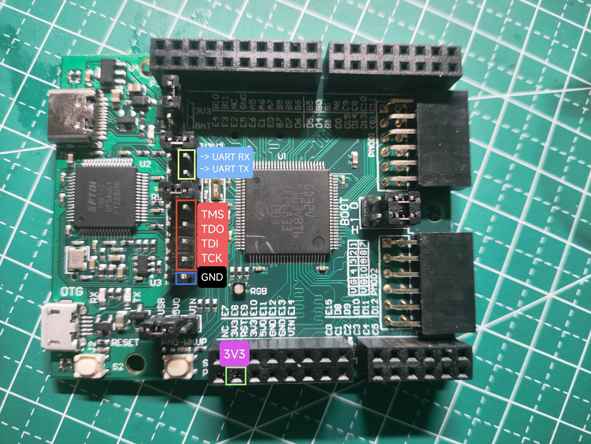

# LiteOS RV-STAR Test Report

## Test Environment

### Operating System Information

- Source Code Link: https://github.com/riscv-mcu/kernel_liteos_m
- Reference Installation Document: https://github.com/riscv-mcu/kernel_liteos_m/blob/nuclei/OpenHarmony-3.0-LTS/targets/riscv_nuclei_gd32vf103_soc_gcc/README.md
- Download Links:
    - Toolchain: https://www.nucleisys.com/download.php
        - https://download.nucleisys.com/upload/files/toolchain/gcc/nuclei_riscv_newlibc_prebuilt_linux64_nuclei-2024.tar.bz2
    - OpenOCD: https://www.nucleisys.com/download.php
        - https://download.nucleisys.com/upload/files/toolchain/openocd/nuclei-openocd-2024.02.28-linux-x64.tgz

### Hardware Information

- RV-STAR Development Board (GD32VF103VBT6)
- A USB to UART Debugger
- **JTAG Debugger**
- A Type-C Cable

## Installation Steps

### Setting Up the Environment

Download and extract the toolchain and OpenOCD, then set up the toolchain directory:
```bash
wget https://download.nucleisys.com/upload/files/toolchain/gcc/nuclei_riscv_newlibc_prebuilt_linux64_nuclei-2024.tar.bz2
tar -xzvf nuclei_riscv_newlibc_prebuilt_linux64_nuclei-2024.tar.bz2
wget https://download.nucleisys.com/upload/files/toolchain/openocd/nuclei-openocd-2024.02.28-linux-x64.tgz
tar -xzvf nuclei-openocd-2024.02.28-linux-x64.tgz
export NUCLEI_TOOL_ROOT=$(pwd)
```

Download the SDK:
```bash
git clone https://github.com/riscv-mcu/kernel_liteos_m.git
cd kernel_liteos_m/targets/riscv_nuclei_gd32vf103_soc_gcc/GCC
```

### Connect to the Board

Consult the following diagram for the pins to connect to your JTAG debugger:



Note that power supply is required through **both** the 3V3 pin and the Type-C port.

### Compiling the Code

Compile LiteOS:
```bash
PREFIX=riscv64-unknown-elf- make all
```

### Flash Image

Make sure your debugger and OpenOCD binary is supported by the build system.
For the former, consider editing relevant settings in `../../../SoC/gd32vf103/Board/gd32vf103v_rvstar/openocd_gd32vf103.cfg` to match your JTAG debugger.
e.g. with Sipeed SLogic Combo 8 debugger at DAP-Link mode:
```diff
diff --git a/targets/riscv_nuclei_gd32vf103_soc_gcc/GCC/openocd_gd32vf103.cfg b/targets/riscv_nuclei_gd32vf103_soc_gcc/GCC/openocd_gd32vf103.cfg
index 019218da..66895b18 100644
--- a/targets/riscv_nuclei_gd32vf103_soc_gcc/GCC/openocd_gd32vf103.cfg
+++ b/targets/riscv_nuclei_gd32vf103_soc_gcc/GCC/openocd_gd32vf103.cfg
@@ -2,8 +2,8 @@ adapter speed     5000
 reset_config    srst_only
 adapter srst pulse_width 100

-adapter driver ftdigd32vf103v_rvstar
-ftdi vid_pid 0x0403 0x6010
+adapter driver cmsis-dap
+cmsis-dap vid_pid 0xd6e7 0x3507

 ## bindto 0.0.0.0 can be used to cover all available interfaces.
 ## Uncomment bindto line to enable remote machine debug
@@ -25,14 +25,14 @@ if { [ info exists JTAGSN ] } {
     adapter serial $JTAGSN
 }

-ftdi layout_init 0x0008 0x001b
-ftdi layout_signal nSRST -oe 0x0020 -data 0x0020
+#ftdi layout_init 0x0008 0x001b
+#ftdi layout_signal nSRST -oe 0x0020 -data 0x0020
 # These signals are used for cJTAG escape sequence on initialization only
-ftdi layout_signal TCK -data 0x0001
-ftdi layout_signal TDI -data 0x0002
-ftdi layout_signal TDO -input 0x0004
-ftdi layout_signal TMS -data 0x0008
-ftdi layout_signal JTAG_SEL -data 0x0100 -oe 0x0100
+#ftdi layout_signal TCK -data 0x0001
+#ftdi layout_signal TDI -data 0x0002
+#ftdi layout_signal TDO -input 0x0004
+#ftdi layout_signal TMS -data 0x0008
+#ftdi layout_signal JTAG_SEL -data 0x0100 -oe 0x0100
 transport select jtag

 set _CHIPNAME riscv
```

Also consider adding an udev rule if necessary (refer to https://github.com/arduino/OpenOCD/blob/master/contrib/60-openocd.rules)
For the latter, make sure your OpenOCD version is up to date with support for your debugger; a known usable version is at https://github.com/xpack-dev-tools/openocd-xpack/releases/tag/v0.12.0-4

You may also want to modify OpenOCD parameters in the Makefile:

```diff
diff --git a/targets/riscv_nuclei_gd32vf103_soc_gcc/GCC/Makefile b/targets/riscv_nuclei_gd32vf103_soc_gcc/GCC/Makefile
index 74b9bf9..785c169 100644
--- a/targets/riscv_nuclei_gd32vf103_soc_gcc/GCC/Makefile
+++ b/targets/riscv_nuclei_gd32vf103_soc_gcc/GCC/Makefile
@@ -133,7 +133,7 @@ GDB_PORT ?= 3333
 ## in remote machine(ipaddr 192.168.43.199, port 3333) which connect the hardware board,
 ## then you can change the GDBREMOTE to 192.168.43.199:3333
 ## GDBREMOTE ?= 192.168.43.199:3333
-GDBREMOTE ?= | $(OPENOCD) --pipe -f $(OPENOCD_CFG)
+GDBREMOTE ?= | $(OPENOCD) -c \"gdb_port pipe; log_output openocd.log\" -f $(OPENOCD_CFG)

 GDB_UPLOAD_ARGS ?= --batch
 GDB_UPLOAD_CMDS += -ex "monitor halt"
```

When all set, flash the binary with:

```bash
make SOC=gd32vf103 BOARD=gd32vf103v_rvstar upload
```

Note that the board should be powered on while flashing.

### Starting the System

Connect to the development board via the serial port.

## Expected Results

The system should start normally, and information should be viewable through the onboard serial port.

## Actual Results

The system booted normally, with information available through the onboard serial port.

### Boot Log

```log
Nuclei SDK Build Time: May 14 2025, 18:44:20
Download Mode: FLASHXIP
CPU Frequency 108000000 Hz
entering kernel init...
Entering scheduler
TaskSampleEntry1 running...
TaskSampleEntry2 running...
TaskSampleEntry1 running...
TaskSampleEntry1 running...
TaskSampleEntry1 running...
TaskSampleEntry1 running...
TaskSampleEntry2 running...
TaskSampleEntry1 running...
TaskSampleEntry1 running...
TaskSampleEntry1 running...
TaskSampleEntry1 running...
TaskSampleEntry1 running...
TaskSampleEntry2 running...
TaskSampleEntry1 running...
TaskSampleEntry1 running...
TaskSampleEntry1 running...
TaskSampleEntry1 running...
TaskSampleEntry1 running...
TaskSampleEntry2 running...
TaskSampleEntry1 running...
TaskSampleEntry1 running...
TaskSampleEntry1 running...
TaskSampleEntry1 running...
TaskSampleEntry1 running...
TaskSampleEntry2 running...
...
(truncated)
```

## Test Criteria

Successful: The actual result matches the expected result.

Failed: The actual result does not match the expected result.

## Test Conclusion

Test successful.
